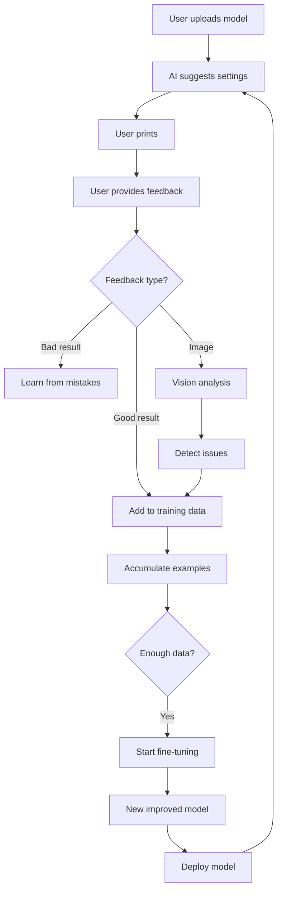

# راهنمای سیستم یادگیری هوش مصنوعی
# AI Learning System Guide

سیستم یادگیری AIPMS به شما امکان می‌دهد که AI را آموزش دهید تا تنظیمات بهتری پیشنهاد کند.

AIPMS Learning System allows you to train the AI to suggest better settings based on your feedback.

---

## 🧠 قابلیت‌های یادگیری / Learning Capabilities

### 1. **فیدبک از نتایج پرینت** / Print Result Feedback
- امتیازدهی سریع (1-5 ستاره)
- فیدبک دقیق با ذکر مشکلات
- آپلود عکس قطعه برای تحلیل با GPT-4 Vision
- فیدبک متنی برای هر پرینت

### 2. **تحلیل تصویر با Vision AI** / Vision AI Analysis
- تشخیص خودکار مشکلات پرینت
- شناسایی: stringing, warping, layer shifts, under/over extrusion
- پیشنهاد راه‌حل برای هر مشکل
- امتیازدهی کیفیت (0-100)

### 3. **یادگیری از 3MF استاندارد** / Learning from Standard 3MF
- وارد کردن فایل‌های 3MF با تنظیمات بهینه
- اضافه کردن توضیحات و یادداشت‌های تخصصی
- ساخت دیتاست آموزشی از پروژه‌های موفق

### 4. **Fine-tuning مدل GPT** / GPT Model Fine-tuning
- آموزش مدل اختصاصی با داده‌های شما
- بهبود مستمر پیشنهادات
- ردیابی عملکرد مدل

---

## 📊 معماری سیستم / System Architecture

```
User Feedback → Database Storage → Training Data → Fine-tuning → Improved AI
     ↓
Vision Analysis (for images)
     ↓
Learning Insights
     ↓
Model Performance Tracking
```

---

## 🚀 نحوه استفاده / How to Use

### مرحله 1: فعال‌سازی MongoDB

```bash
# نصب MongoDB (Ubuntu/Debian)
sudo apt-get install mongodb

# یا با Docker
docker run -d -p 27017:27017 --name mongodb mongo:latest

# تنظیم .env
echo "MONGODB_URI=mongodb://localhost:27017/aipms" >> .env
```

### مرحله 2: اجرای سیستم

```bash
npm run dev
```

### مرحله 3: ثبت فیدبک

پس از هر پرینت، می‌توانید فیدبک بدهید:

#### الف) امتیازدهی سریع
```
⭐ 1-5 ستاره + نظر کوتاه
```

#### ب) فیدبک دقیق
```
✓ انتخاب کیفیت کلی (عالی/خوب/متوسط/ضعیف)
✓ مشکلات مشاهده شده (stringing, warping, etc.)
✓ توضیحات تکمیلی
```

#### ج) آپلود عکس
```
📸 آپلود 1-5 عکس از قطعه
🤖 تحلیل خودکار با GPT-4 Vision
✨ دریافت پیشنهادات بهبود
```

---

## 🎓 آموزش AI / Training the AI

### 1. جمع‌آوری داده‌های آموزشی

```typescript
// بعد از پرینت موفق، فیدبک مثبت بدهید
POST /api/learning/feedback/quick
{
  "historyId": "...",
  "rating": 5,
  "comments": "پرینت عالی بود!"
}
```

### 2. وارد کردن 3MF استاندارد

```typescript
POST /api/learning/training/import-3mf
FormData: {
  file: [3mf file],
  description: "تنظیمات بهینه برای PLA",
  expertNotes: "این تنظیمات برای مدل‌های پیچیده مناسب است",
  quality: "excellent"
}
```

### 3. مشاهده آمار آموزشی

```typescript
GET /api/learning/training/stats

Response:
{
  "totalExamples": 150,
  "byQuality": {
    "excellent": 45,
    "good": 80,
    "acceptable": 20,
    "poor": 5
  },
  "validated": 100
}
```

### 4. شروع Fine-tuning

```typescript
POST /api/learning/fine-tuning/start
{
  "baseModel": "gpt-4o-mini-2024-07-18",
  "minQuality": "good",
  "epochs": 3
}

Response:
{
  "jobId": "ftjob-xxx",
  "status": "running",
  "message": "Fine-tuning started"
}
```

### 5. بررسی وضعیت آموزش

```typescript
GET /api/learning/fine-tuning/status/ftjob-xxx

Response:
{
  "status": "succeeded",
  "fineTunedModel": "ft:gpt-4o-mini:aipms:xxx",
  "createdAt": "...",
  "finishedAt": "..."
}
```

### 6. استقرار مدل

```typescript
POST /api/learning/fine-tuning/deploy/ftjob-xxx

Response:
{
  "success": true,
  "modelId": "ft:gpt-4o-mini:aipms:xxx",
  "message": "Model deployed"
}
```

---

## 📈 ردیابی عملکرد / Performance Tracking

سیستم به صورت خودکار عملکرد را ردیابی می‌کند:

```typescript
GET /api/learning/performance

Response:
{
  "metrics": {
    "totalPredictions": 500,
    "successfulPrints": 450,
    "failedPrints": 50,
    "averageUserRating": 4.3,
    "commonIssues": [
      { "issue": "stringing", "frequency": 15 },
      { "issue": "warping", "frequency": 10 }
    ]
  }
}
```

---

## 🔄 چرخه یادگیری / Learning Loop



---

## 💡 نکات مهم / Important Notes

### برای بهترین نتایج:

1. **فیدبک منظم دهید**
   - حداقل 50-100 مثال برای fine-tuning خوب
   - هر چه بیشتر، بهتر!

2. **عکس‌های با کیفیت**
   - نور کافی
   - زوایای مختلف
   - فوکوس روی مشکلات

3. **فیدبک دقیق**
   - مشکلات را به درستی نام‌گذاری کنید
   - توضیحات مفید بنویسید

4. **اعتبارسنجی داده‌ها**
   - داده‌های با کیفیت بالا را تایید کنید
   - داده‌های ضعیف را حذف کنید

---

## 🔒 حریم خصوصی / Privacy

- تمام داده‌ها local ذخیره می‌شوند (MongoDB)
- عکس‌ها فقط برای تحلیل به OpenAI ارسال می‌شوند
- Fine-tuning روی دیتای شما انجام می‌شود
- مدل نهایی اختصاصی شماست

---

## 🎯 مثال واقعی / Real Example

```typescript
// 1. پرینت یک مدل
const result = await sliceAndPrint(model, settings)

// 2. ثبت تاریخچه
const history = await saveHistory({
  modelInfo,
  settings,
  material,
  printer
})

// 3. بعد از پرینت، عکس بگیرید
const images = [photo1.jpg, photo2.jpg]

// 4. فیدبک دهید
await submitImageFeedback(history.id, images, {
  rating: 5,
  comments: "پرینت عالی! هیچ مشکلی نبود"
})

// 5. AI خودکار یاد می‌گیرد
// تنظیمات شما به training data اضافه می‌شود

// 6. بعد از 100 پرینت موفق:
await startFineTuning()

// 7. مدل جدید deploy کنید
await deployModel(jobId)

// 8. از این به بعد AI بهتر پیشنهاد می‌دهد! 🎉
```

---

## 🛠️ عیب‌یابی / Troubleshooting

### MongoDB وصل نمی‌شود
```bash
# بررسی کنید MongoDB اجرا شده
sudo systemctl status mongodb

# یا با Docker
docker ps | grep mongo
```

### Fine-tuning خطا می‌دهد
```bash
# بررسی کنید OpenAI API key معتبر است
echo $OPENAI_API_KEY

# بررسی کنید حداقل 10 training example دارید
curl http://localhost:3000/api/learning/training/stats
```

### Vision API کار نمی‌کند
```bash
# مطمئن شوید از GPT-4 with vision استفاده می‌کنید
# مدل باید gpt-4o باشد
```

---

## 📚 منابع بیشتر / Additional Resources

- [OpenAI Fine-tuning Guide](https://platform.openai.com/docs/guides/fine-tuning)
- [GPT-4 Vision API](https://platform.openai.com/docs/guides/vision)
- [MongoDB Documentation](https://docs.mongodb.com/)

---

## 🎓 مثال‌های کاربردی / Use Cases

### 1. تخصصی‌سازی برای یک مواد خاص
```
- 100+ پرینت PLA موفق
- Fine-tune مدل فقط برای PLA
- دقت بسیار بالا برای تنظیمات PLA
```

### 2. یادگیری از اشتباهات
```
- پرینت با stringing زیاد
- فیدبک: "مشکل stringing داشت"
- AI یاد می‌گیرد retraction را بیشتر کند
```

### 3. بهینه‌سازی برای پرینتر خاص
```
- همه داده‌ها از یک پرینتر
- AI یاد می‌گیرد محدودیت‌های آن پرینتر
- پیشنهادات بهینه برای آن پرینتر
```

---

**نکته:** سیستم یادگیری هر چه بیشتر استفاده شود، دقیق‌تر و بهتر می‌شود! 🚀

**Note:** The more you use the learning system, the more accurate and better it becomes! 🚀
